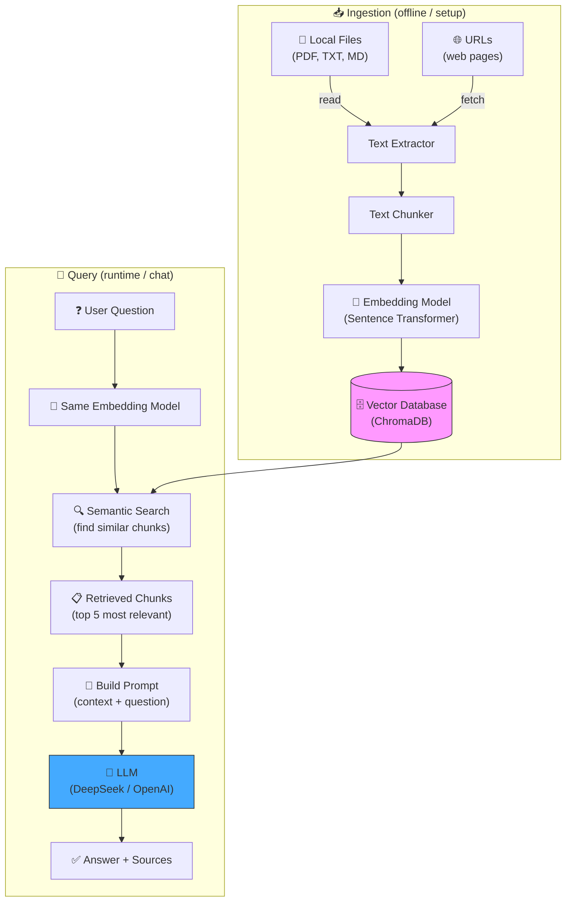
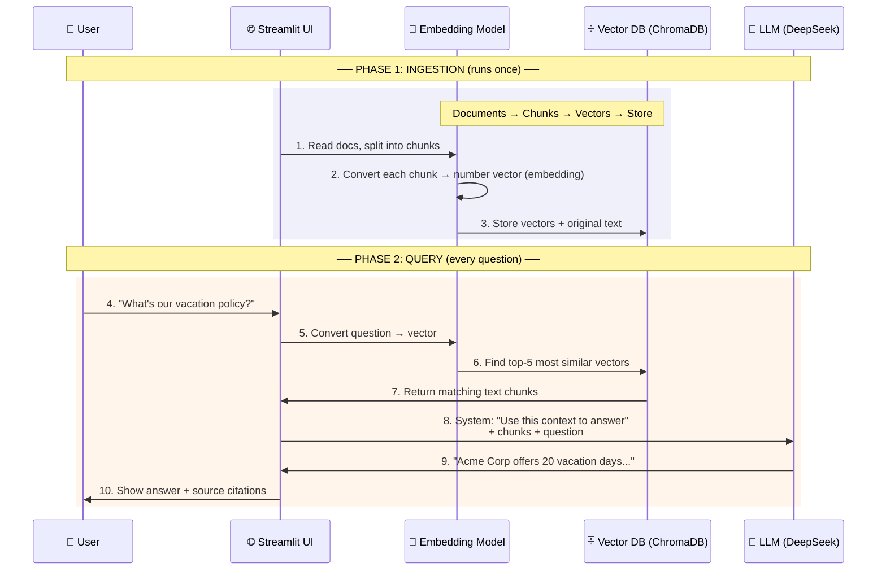
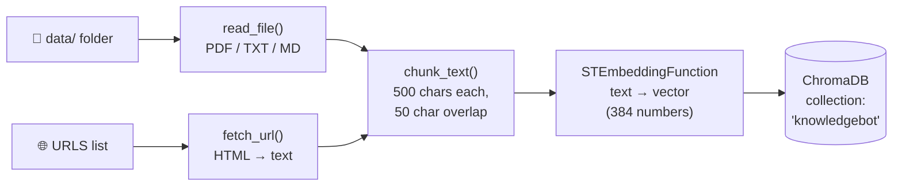
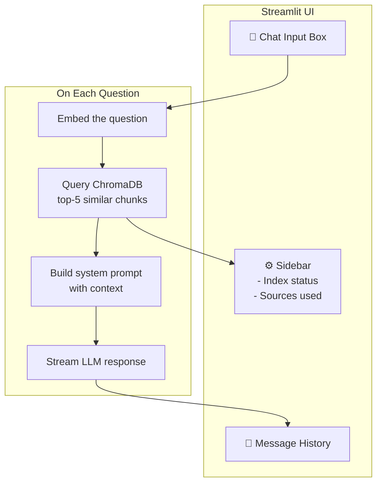

# 📚 KnowledgeBot — A Beginner's Guide to RAG Chatbots

> **Goal**: Learn how to build an AI-powered company knowledge search using **LLMs**, **RAG**, and a **chat interface** — from scratch, with every concept explained.

---

## Table of Contents

1. [What is KnowledgeBot?](#what-is-knowledgebot)
2. [High-Level Architecture](#high-level-architecture)
3. [The RAG Pipeline (Step-by-Step)](#the-rag-pipeline-step-by-step)
4. [Project Structure](#project-structure)
5. [Every File Explained](#every-file-explained)
6. [Glossary — Every AI Term You Need](#glossary--every-ai-term-you-need)
7. [Setup & Usage](#setup--usage)
8. [Data Flow Walkthrough](#data-flow-walkthrough)

---

## What is KnowledgeBot?

KnowledgeBot lets you **chat with your company's documents**. You drop files (PDFs, text files, web pages) into a folder, run one command to index them, then ask questions in natural language. The bot finds the most relevant passages and uses an LLM to answer **grounded in your actual documents** — not made-up information.

### The Problem It Solves

| Without KnowledgeBot | With KnowledgeBot |
|---|---|
| Search through folders, wikis, PDFs manually | Ask a question in plain English |
| Read entire documents to find one fact | Get a direct answer with source citations |
| Information scattered across many places | Single chat interface for all knowledge |
| LLMs hallucinate (make things up) | LLM is grounded in your real documents |

---

## High-Level Architecture



## The RAG Pipeline (Step-by-Step)

**RAG** = **R**etrieval-**A**ugmented **G**eneration. It's a technique that gives an LLM access to a knowledge base so it can look up facts before answering. Here's how it works:



### Why RAG?

| Approach | Pro | Con |
|---|---|---|
| **LLM alone** | Simple | Hallucinates, doesn't know your data |
| **Fine-tuning** | Custom knowledge | Expensive, becomes stale, complex |
| **RAG** ✅ | Grounded in your docs, easy to update, cheap | Slightly more complex setup |

---

## Project Structure

```
knowledgebot/
├── .env.example           # Template for your API keys
├── .env                   # Your actual keys (git-ignored)
├── .gitignore             # Files git should ignore
├── requirements.txt       # Python dependencies
├── ingest.py              # 📥 Document indexing script
├── app.py                 # 💬 Streamlit chat application
├── data/                  # 📂 Drop your documents here
│   └── company_info.txt   #     (sample included)
└── chroma_db/             # 🗄️ Vector database (auto-created)
```

---

## Every File Explained

### `requirements.txt` — Dependencies

| Package | Purpose | Category |
|---|---|---|
| `streamlit` | Builds the chat web UI with ~50 lines of Python | Web Framework |
| `openai` | Python client for OpenAI-compatible APIs (DeepSeek, OpenAI, etc.) | LLM Client |
| `chromadb` | Embedded vector database — stores text + its vector representation | Vector Database |
| `sentence-transformers` | Runs the embedding model that converts text → number vectors | Embeddings |
| `pypdf` | Reads text from PDF files | Document Parser |
| `beautifulsoup4` | Extracts text from HTML web pages | Web Scraper |
| `requests` | Makes HTTP requests to fetch URLs | HTTP Client |
| `python-dotenv` | Loads environment variables from `.env` file | Config |

### `.env` / `.env.example` — Configuration

```
LLM_API_KEY=sk-your-key-here    # Your DeepSeek (or OpenAI) API key
LLM_BASE_URL=https://api.deepseek.com   # API endpoint URL
LLM_MODEL=deepseek-chat                  # Which model to use
```

| Variable | What It Does |
|---|---|
| `LLM_API_KEY` | Authenticates you with the LLM provider. **Never commit this to git.** |
| `LLM_BASE_URL` | The API server address. Different for each provider (OpenAI, DeepSeek, local Ollama, etc.) |
| `LLM_MODEL` | Which model to call. DeepSeek: `deepseek-chat`, OpenAI: `gpt-4o-mini` |

### `ingest.py` — Document Indexing

**What it does**: Reads all your documents, converts them into searchable vectors, and stores them in the vector database.



#### Key functions:

| Function | Input | Output | What It Does |
|---|---|---|---|
| `chunk_text(text, source)` | Raw text + filename | List of `{text, source}` dicts | Splits long text into 500-char overlapping pieces. **Why?** LLMs have context limits, and smaller chunks give more precise search results. |
| `read_file(path)` | File path (`.pdf`, `.txt`, `.md`) | Extracted text or `None` | Reads different file formats into plain text |
| `fetch_url(url)` | A URL string | Cleaned text or `None` | Downloads a web page, strips HTML tags, scripts, nav, and footer |
| `STEmbeddingFunction.__call__(input)` | List of text strings | List of vectors (384-dim) | **The magic**: converts text into numbers that capture semantic meaning |
| `collection.add(...)` | Chunks + vectors | — | Stores text and its vector in ChromaDB for later search |

#### Key concepts in `ingest.py`:

**Chunking** (`CHUNK_SIZE=500`, `CHUNK_OVERLAP=50`):
```
Original: "The quick brown fox jumps over the lazy dog. This is a long document..."
Chunk 1:  "The quick brown fox jumps over the lazy dog. This is a long document [500 chars]"
Chunk 2:  "...[50 char overlap]...document continues here with more content [500 chars]"
```
> Overlap prevents cutting a sentence in half, so meaning isn't lost at chunk boundaries.

**Embedding** (text → vector):
```
"vacation policy" → [0.12, -0.34, 0.87, ..., 0.05]  (384 numbers)
"holiday rules"   → [0.11, -0.32, 0.85, ..., 0.04]  (very similar vector!)
"server config"   → [-0.78, 0.21, -0.44, ..., 0.91] (very different vector)
```
> Words with similar *meaning* get similar *vectors*, even if they use different words.

### `app.py` — Chat Application

**What it does**: Provides the chat UI, searches the vector database, and calls the LLM to generate answers.



#### Key functions:

| Function | What It Does |
|---|---|
| `init_chroma()` | Loads the vector database and embedding model. `@st.cache_resource` means it runs only once and reuses across users. |
| `init_llm()` | Creates the API client for the LLM (DeepSeek/OpenAI). |
| `collection.query(query_texts=[...], n_results=TOP_K)` | Searches for the 5 chunks most semantically similar to the question |
| `client.chat.completions.create(model=..., messages=[...], stream=True)` | Calls the LLM API with the context + question, streams the answer token by token |
| `st.write_stream(stream)` | Renders the streaming response in real time |

#### The Prompt Structure:

```python
system_prompt = """
You are a helpful knowledge base assistant.
Answer ONLY using the provided context below.
If the context doesn't contain the answer,
say so honestly.
Cite sources when possible.

CONTEXT:
[Source: company_info.txt]
Acme Corp was founded in 2018...

[Source: policy.pdf]
Employees get 20 days of paid vacation...
"""
```

| Role | Purpose |
|---|---|
| **System** | Instructions that control the LLM's behavior. Here: "only use the context, don't make things up." |
| **User** | The actual question from the user |
| **Assistant** | The LLM's response |

#### `@st.cache_resource` — Why?

Loading the embedding model (~80MB) and connecting to ChromaDB are **expensive** operations. Without caching, they'd run on every keystroke. `@st.cache_resource` tells Streamlit: "do this once, remember the result forever."

---

## Glossary — Every AI Term You Need

### Foundational Concepts

| Term | Simple Explanation | Analogy |
|---|---|---|
| **AI (Artificial Intelligence)** | Software that can perform tasks that normally require human intelligence | A robot brain |
| **ML (Machine Learning)** | AI that learns patterns from data instead of being explicitly programmed | Teaching a child by showing examples |
| **NLP (Natural Language Processing)** | AI that understands and generates human language | Teaching computers to read and write |
| **LLM (Large Language Model)** | A massive neural network trained on internet-scale text to predict the next word | An autocomplete on steroids, with reasoning |
| **Transformer** | The neural network architecture behind all modern LLMs (GPT, Claude, DeepSeek) | The "engine" design that makes LLMs possible |
| **Token** | A piece of text the LLM processes: a word, part of a word, or punctuation | Letters, but for AI: "knowledge" might be 2 tokens ("know", "ledge") |
| **Context Window** | How many tokens the LLM can "see" at once | Short-term memory size |
| **Parameters** | The "knobs" inside a neural network that are tuned during training | Brain cells: more = smarter (but slower) |
| **Training** | The process of showing an LLM billions of text examples so it learns language patterns | Years of schooling |
| **Inference** | Using a trained model to generate output (answering your question) | Taking a test |

### Embeddings & Vectors

| Term | Simple Explanation | Example |
|---|---|---|
| **Vector** | A list of numbers that represents something | `[0.1, -0.5, 0.8, ...]` |
| **Embedding** | Converting text into a vector that captures its meaning | "king" → `[0.2, 0.7, -0.3, ...]` |
| **Embedding Model** | A (usually smaller) neural network that converts text → vectors | `all-MiniLM-L6-v2` — free, runs locally |
| **Dimension** | How many numbers are in the vector | 384 numbers for our model |
| **Cosine Similarity** | Measures how "close" two vectors are in meaning-space | 1.0 = identical meaning, 0 = unrelated, -1 = opposite |
| **Semantic Search** | Finding text by *meaning*, not just keyword matching | "time off" finds "vacation policy" even though no words match |

### Vector Database

| Term | Simple Explanation |
|---|---|
| **Vector Database** | A specialized database that stores vectors and can quickly find the "nearest neighbors" |
| **ChromaDB** | An open-source, embedded vector database — no server needed, works like SQLite |
| **Collection** | A named group of documents in ChromaDB (like a table in SQL) |
| **Metadata** | Extra data attached to each chunk (source filename, etc.) |
| **ANN (Approximate Nearest Neighbor)** | Fast algorithm to find similar vectors without checking every single one |

### RAG (Retrieval-Augmented Generation)

| Term | Simple Explanation |
|---|---|
| **Retrieval** | The "R" — searching your knowledge base for relevant information |
| **Augmented** | The "A" — adding that information to the LLM's prompt |
| **Generation** | The "G" — the LLM writing an answer based on the augmented prompt |
| **Chunk** | A small piece of a document (~500 chars) stored in the vector DB |
| **Chunk Overlap** | Characters shared between adjacent chunks to avoid cutting sentences |
| **Top-K** | How many chunks to retrieve (K=5 means "get the 5 best matches") |
| **Grounding** | Making the LLM's answer factually tied to real documents — the opposite of hallucination |
| **Hallucination** | When an LLM confidently states something false because it has no way to check facts |
| **System Prompt** | Instructions that set the LLM's behavior and constraints |
| **Prompt Engineering** | The art of writing prompts that get the best results from an LLM |

### Technical Stack

| Term | Simple Explanation | Why We Chose It |
|---|---|---|
| **Streamlit** | Python library that turns scripts into web apps | Chat UI in ~20 lines of code |
| **Python** | The dominant programming language for AI/ML | Every AI library has Python bindings |
| **Sentence Transformers** | Library for running embedding models locally | Free, no API calls needed for embeddings |
| **all-MiniLM-L6-v2** | A small, fast embedding model (80MB, 384 dimensions) | Good quality, runs on any laptop |
| **DeepSeek** | An AI company providing OpenAI-compatible API | Cheap, high-quality LLM |
| **API Key** | A secret string that identifies you to a paid service | Like a password for machines |
| **Base URL** | The web address where an API lives | `https://api.deepseek.com` for DeepSeek |
| **Streaming** | Getting the LLM's response token-by-token instead of all at once | Feels faster: you see words appear in real time |
| **.env file** | A file storing configuration secrets that is never committed to git | Keeps API keys safe |

### ChromaDB Embedding Function Interface

| Method | Required By | Purpose |
|---|---|---|
| `__init__()` | ChromaDB | Create the embedding function instance |
| `__call__(input)` | ChromaDB (ingestion) | Embed documents during indexing |
| `embed_query(input)` | ChromaDB (query) | Embed a question during search |
| `name()` | ChromaDB | Identify the embedding function |
| `build_from_config(config)` | ChromaDB | Reconstruct from saved config |
| `get_config()` | ChromaDB | Serialize config for storage |

---

## Setup & Usage

### 1. Install Dependencies

```bash
pip install -r requirements.txt
```

### 2. Configure API Key

```bash
cp .env.example .env
```

Edit `.env` with your real credentials:

```bash
# For DeepSeek (default):
LLM_API_KEY=sk-your-actual-deepseek-key
LLM_BASE_URL=https://api.deepseek.com
LLM_MODEL=deepseek-chat

# For OpenAI:
LLM_API_KEY=sk-your-openai-key
LLM_BASE_URL=https://api.openai.com/v1
LLM_MODEL=gpt-4o-mini

# For local Ollama:
LLM_API_KEY=ollama
LLM_BASE_URL=http://localhost:11434/v1
LLM_MODEL=llama3
```

### 3. Add Your Documents

Drop files into the `data/` folder:

| Format | Extension | Example |
|---|---|---|
| Plain Text | `.txt` | Handbooks, policies, notes |
| Markdown | `.md` | READMEs, documentation |
| PDF | `.pdf` | Official documents, manuals |

For URLs, edit the `URLS` list at the top of `ingest.py`:

```python
URLS = [
    "https://your-company.com/hr-policies",
    "https://wiki.internal.com/engineering",
]
```

### 4. Index Documents

```bash
python ingest.py
```

Expected output:
```
🔧 Loading embedding model...
📂 Setting up ChromaDB...
  ✓ company_info.txt → 3 chunks
  ✓ handbook.pdf → 12 chunks

📥 Storing 15 chunks from 2 documents...
✅ Done! 15 chunks indexed in ChromaDB.
   Run: streamlit run app.py
```

### 5. Start the Chat App

```bash
streamlit run app.py
```

Opens `http://localhost:8501` in your browser. Start asking questions!

### 6. Adding More Documents Later

1. Add new files to `data/` (or URLs to `ingest.py`)
2. Run `python ingest.py` again (it replaces the old index)
3. Refresh the Streamlit app

---

## Data Flow Walkthrough

Here's exactly what happens when you ask *"What's the vacation policy?"* — traced through every line of code:

### Step 1: User types question → Streamlit detects input

```python
# app.py line ~103
if prompt := st.chat_input("Ask a question about your documents..."):
```
`prompt` is now `"What's the vacation policy?"`

### Step 2: Embed the question

```python
# app.py line ~118 — collection.query() internally calls:
emb_fn.embed_query(["What's the vacation policy?"])
# → [[0.023, -0.451, 0.892, ..., 0.134]]  (384 numbers)
```

The **same** embedding model used for documents must be used for questions, so "vacation policy" lands near "Employees get 20 days of paid vacation..." in vector space.

### Step 3: Semantic search in ChromaDB

```python
results = collection.query(query_texts=[prompt], n_results=5)
```

ChromaDB uses **cosine similarity** internally:

```
Question vector vs Chunk 1 ("vacation policy...")     → similarity 0.92 ← BEST
Question vector vs Chunk 2 ("employee benefits...")    → similarity 0.78
Question vector vs Chunk 3 ("security policy...")      → similarity 0.12
Question vector vs Chunk 4 ("tech stack...")           → similarity 0.03
```

Returns the top 5 chunks with their source metadata.

### Step 4: Build the augmented prompt

```python
context = "\n\n---\n\n".join(
    f"[Source: {s['source']}]\n{c}" for c, s in zip(chunks, sources)
)

system_prompt = (
    "You are a helpful knowledge base assistant..."
    f"CONTEXT:\n{context}"
)
```

The LLM now "sees" this full prompt:

```
System: You are a helpful knowledge base assistant. Answer using ONLY the
provided context. Cite sources.

CONTEXT:
[Source: company_info.txt]
Employees get 20 days of paid vacation per year. Unused vacation days
roll over up to a maximum of 30 days. You must submit vacation requests
at least 2 weeks in advance through the HR portal.

[Source: handbook.pdf]
... (more chunks) ...

User: What's the vacation policy?
```

### Step 5: LLM generates the answer

```python
stream = client.chat.completions.create(
    model="deepseek-chat",
    messages=[
        {"role": "system", "content": system_prompt},
        {"role": "user", "content": prompt},
    ],
    stream=True,
)
response = st.write_stream(stream)
```

The LLM reads the context, finds the relevant facts, and generates:

> "According to the company handbook, Acme Corp offers 20 days of paid vacation per year. Unused days can roll over up to 30 days maximum. Employees must submit vacation requests at least 2 weeks in advance through the HR portal."

### Step 6: Show sources

The sidebar displays which documents were used to generate the answer, so users can verify the information.

---

## Customization Ideas

| Idea | How To |
|---|---|
| Use a different LLM | Change `LLM_BASE_URL` and `LLM_MODEL` in `.env` |
| Adjust chunk size | Change `CHUNK_SIZE` and `CHUNK_OVERLAP` in `ingest.py` |
| Retrieve more/fewer chunks | Change `TOP_K` in `app.py` |
| Add more URL sources | Edit the `URLS` list in `ingest.py` |
| Change embedding model | Update `EMBED_MODEL` in both files |
| Persist chat history | Streamlit handles this via `st.session_state` already |
| Deploy to the web | Use [Streamlit Community Cloud](https://streamlit.io/cloud) (free) |
